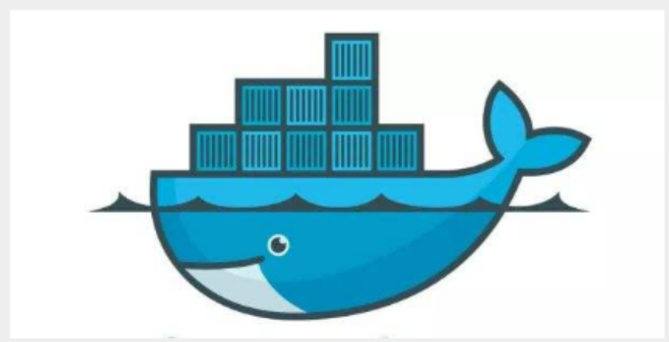
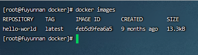

# 学习目标
1. 认识docker
2. 安装docker
3. docker常用命令介绍
4. 制作自己的dockerfile 文件
5. 搭建自己的php开发环境（学习docker-compose 相关）
6. 了解docker 网络
7. 搭建自己的docker swarm集群
8. 未来憧憬和探讨（k8s等）

## 认识docker
docker 大概在2010 的时候是由美国的dotCloud 做云计算的公司的开源的项目

前瞻 
在容器技术之前，业界的网红是虚拟机。虚拟机技术的代表，是VMWare和OpenStack

认识doker
Docker是基于Go语言实现的云开源项目。
docker 能快速解决环境的发布，环境的隔离,环境的迁移等
Docker镜像的设计，使得Docker得以打破过去「程序即应用」的观念。通过Docker镜像 ( images ) 将应用程序所需要的系统环境，由下而上打包，达到应用程序跨平台间的无缝接轨运作。

Docker是内核级虚拟化，其不像传统的虚拟化技术一样需要额外的Hypervisor [管理程序] 支持，所以在
一台物理机上可以运行很多个容器实例，可大大提升物理服务器的CPU和内存的利用率



Docker的思想来自于集装箱，集装箱解决了什么问题？在一艘大船上，可以把货物规整的摆放起来。并
且各种各样的货物被集装箱标准化了，集装箱和集装箱之间不会互相影响。那么我就不需要专门运送水
果的船和专门运送化学品的船了。只要这些货物在集装箱里封装的好好的，那我就可以用一艘大船把他
们都运走。

如何工作的？
Docker是一个Client-Server结构的系统，Docker守护进程运行在主机上， 然后通过Socket连接从客户端访问，守护进程从客户端接受命令并管理运行在主机上的容器。 容器，是一个运行时环境，就是我们
前面说到的集装箱。


docker 重要组成部分

镜像（image）:
Docker 镜像（Image）就是一个只读的模板。镜像可以用来创建 Docker 容器，一个镜像可以创建很 多容器。 就好似 PHP 中的 类和对象，类就是镜像，容器就是对象

容器（container）:
Docker 利用容器（Container）独立运行的一个或一组应用。容器是用镜像创建的运行实例。 它可以被启动、开始、停止、删除。每个容器都是相互隔离的，保证安全的平台。 可以把容器看做是一个简易版的 Linux 环境（包括root用户权限、进程空间、用户空间和网络空间等） 和运行在其中的应用程序。。 容器的定义和镜像几乎一模一样，也是一堆层的统一视角，唯一区别在于容器的最上面那一层是可读可写 的。

仓库（repository）：
仓库（Repository）是集中存放镜像文件的场所。 仓库(Repository)和仓库注册服务器（Registry）是有区别的。仓库注册服务器上往往存放着多个仓 库，每个仓库中又包含了多个镜像，每个镜像有不同的标签（tag）。 仓库分为公开仓库（Public）和私有仓库（Private）两种形式。 最大的公开仓库是 Docker Hub(https://hub.docker.com/)，存放了数量庞大的镜像供用户下载。 国内的公开仓库包括阿里云 、网易云 等

小结：
需要正确的理解仓储/镜像/容器这几个概念 :
Docker 本身是一个容器运行载体或称之为管理引擎。我们把应用程序和配置依赖打包好形成一个
可交付的运行环境，这个打包好的运行环境就似乎 image镜像文件。只有通过这个镜像文件才能生
成 Docker 容器。image 文件可以看作是容器的模板。Docker 根据 image 文件生成容器的实例。
同一个 image 文件，可以生成多个同时运行的容器实例。
image 文件生成的容器实例，本身也是一个文件，称为镜像文件。
一个容器运行一种服务，当我们需要的时候，就可以通过docker客户端创建一个对应的运行实例，
也就是我们的容器
至于仓库，就是放了一堆镜像的地方，我们可以把镜像发布到仓库中，需要的时候从仓库中拉下来
就可以了。

- Docker官网：http://www.docker.com
- Docker中文网站：https://www.docker-cn.com
- Docker Hub官网：https://hub.docker.com （仓库）

## 安装docker

```环境准备
liunx centos7.9
```
- 卸载：
 sudo yum remove docker \
                  docker-client \
                  docker-client-latest \
                  docker-common \
                  docker-latest \
                  docker-latest-logrotate \
                  docker-logrotate \
                  docker-engine
1. 安装依赖

sudo yum install -y yum-utils
sudo yum-config-manager \
    --add-repo \
    https://download.docker.com/linux/centos/docker-ce.repo
2. 安装最新版本的 Docker引擎客户端工具
sudo yum install docker-ce docker-ce-cli containerd.io docker-compose-plugin

查看版本的客户端 （yum list installed|grep docker 命令查看）

指定版本安装 sudo yum install docker-ce-<VERSION_STRING> docker-ce-cli-<VERSION_STRING> containerd.io docker-compose-plugin

3. 启动docker
systemctl start docker 启动docker
systemctl enable docker 设置开机自启动
systemctl restart docker 重启doker

4. 运行hello world
docekr vesion
docker run hello-world

5. 设置阿里云镜像加速
sudo mkdir -p /etc/docker
sudo tee /etc/docker/daemon.json <<-'EOF'
{
  "registry-mirrors": ["https://n4yhsqhw.mirror.aliyuncs.com"]
}
EOF
sudo systemctl daemon-reload
sudo systemctl restart docker

安装问题：
更换yum 源

cd /etc/yum.repos.d \
mv CentOS-Base.repo CentOS-Base.repo.backup \
wget http://mirrors.163.com/.help/CentOS7-Base-163.repo \
mv CentOS7-Base-163.repo CentOS-Base.repo \
yum clean all \


## docker常用命令介绍
- 镜像命令
    1. docker iamges

    
    ```
    # 解释 
    REPOSITORY 镜像的仓库源 
    TAG 镜像的标签 
    IMAGE ID 镜像的ID 
    CREATED 镜像创建时间 
    SIZE 镜像大小 
    # 同一个仓库源可以有多个 TAG，代表这个仓库源的不同版本，我们使用REPOSITORY：TAG 定义不同 的镜像，如果你不定义镜像的标签版本，docker将默认使用 lastest 镜像！ 
    # 可选项 
    -a： 列出本地所有镜像
    -q： 只显示镜像id 
    --digests： 显示镜像的摘要信息
    ```
    2. docker search
    在镜像库查找某个镜像
    可选项 
    --filter=stars=50 ： 列出收藏数不小于指定值的镜像。

    3. docker pull 镜像名:tag
    拉取镜像
    docker pull mysql 不写版本后默认拉取最新

    4. docker rmi 删除镜像
    删除镜像 
    docker rmi -f 镜像id #删除单个
    docker rmi -f 镜像名:tag 镜像名:tag #删除多个
    docker rmi -f $(docker images -qa) # 删除全部
- 容器命令
    1. docker run [OPTIONS] IMAGE [COMMAND][ARG...]
    ```
    # 常用参数说明 --name="Name" # 给容器指定一个名字 -d 
    # 后台方式运行容器，并返回容器的id！ -i
    # 以交互模式运行容器，通过和 -t 一起使用 -t 
    # 给容器重新分配一个终端，通常和 -i 一起使用 -P
    # 随机端口映射（大写） -p # 指定端口映射
      （小结），一般可以有四种写法 ip:hostPort:containerPort ip::containerPort hostPort:containerPort (常用) containerPort
    ```  
    2. docker ps 查看容器
    

    3. 启动停止容器
    ```
    docker start (容器id or 容器名) # 启动容器 
    docker restart (容器id or 容器名) # 重启容器 
    docker stop (容器id or 容器名) # 停止容器 
    docker kill (容器id or 容器名) # 强制停止容器 
    ```
    4. 查看容器启动日志
    docker logs -f -t --tail 容器id

    5. docker inspect 容器id （查看容器/镜像的元数据）
    里面就是容器创建的生成加载的配置信息 包含网络等

    6. 进入正在运行的容器
    ```
    1.docker exec -it 容器id bashShell (推荐)
    ex: docker exec -it hhhhdadada /bin/bash
    2.docker attach 容器id
    # 区别
    # exec 是在容器中打开新的终端，并且可以启动新的进程 
    # attach 直接进入容器启动命令的终端，不会启动新的进程
    ```
    7. 将文件拷贝到主机上
    docker cp 容器id:容器内路径 目的主机路径

    
    
- 容器数据化

    将应用和运行的环境打包形成容器运行，运行可以伴随着容器，但是我们对于数据的要求，是希望能够持久化的！就好比，你安装一个MySQL，结果你把容器删了，就相当于删库跑路了.
    总结一句话： 就是容器的持久化，以及容器间的继承和数据共享
    1. 命令：
    > docker run -it -v 宿主机绝对路径目录:容器内目录 镜像名
    > ex: docker run -it -v /home/test:/home centos /bin/bash

    
    

    测试：mysql 数据持久化
    

    2. 匿名和具名挂载（有兴趣的可以下去了解）
   